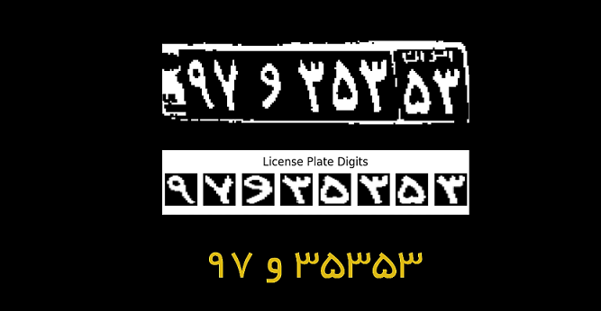
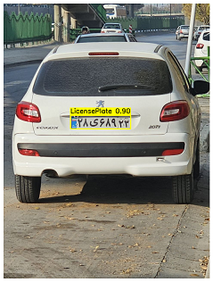
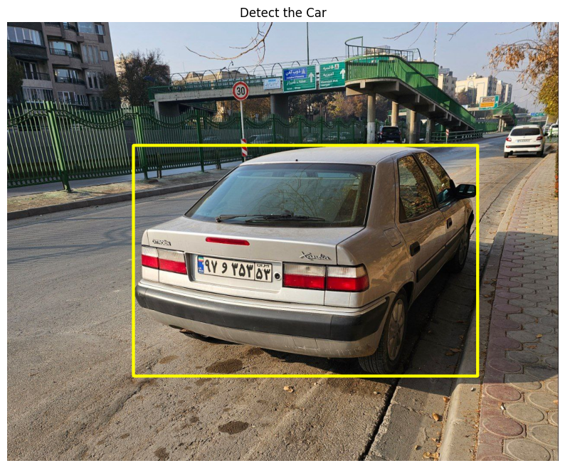
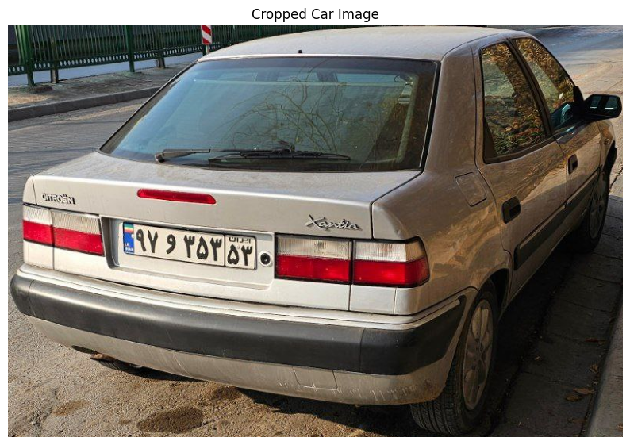
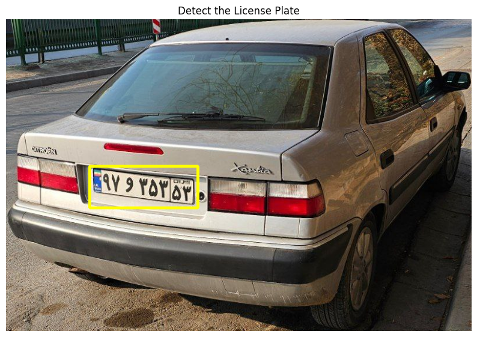
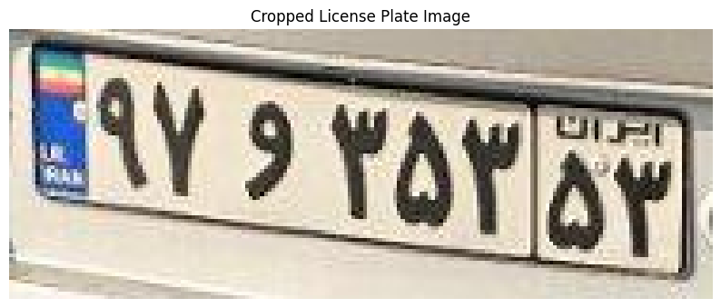
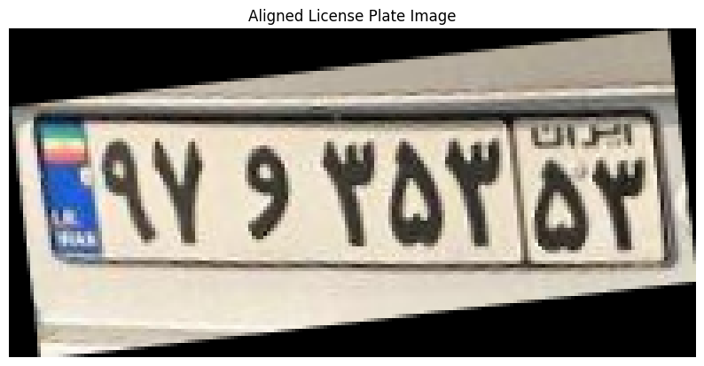
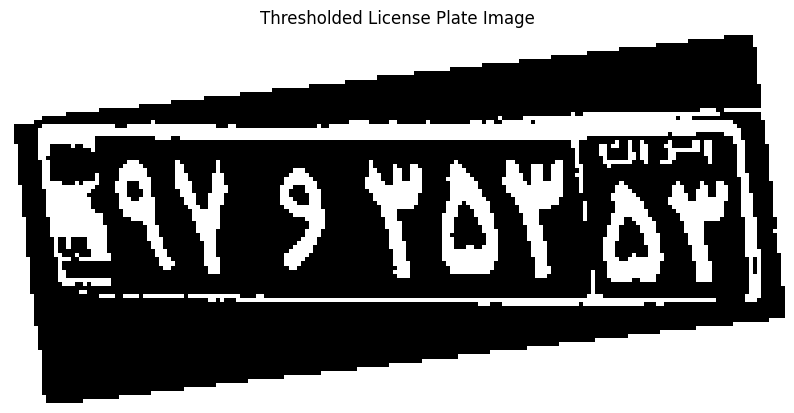
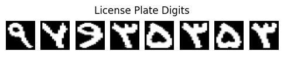
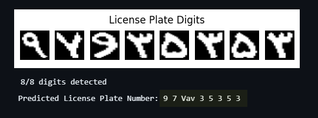

# License Plate Recognition with YOLO11 and OpenCV

This is my implementation of a license plate recognition system using YOLO11 and OpenCV.

You can watch the video of the project here: https://youtube.com/shorts/U5-655aJCfs

This project is split into three parts:

1. Fine-tuning YOLO11 on a [License Plate Dataset](https://universe.roboflow.com/mochoye/license-plate-detector-ogxxg)
2. Extracting license plate digits from the license plate image using OpenCV
3. Training a classifier to recognize the extracted license plate digits

## Fine-tuning YOLO11 on a License Plate Dataset

Fine-tuning YOLO11 is done in [License_Plate_Detection_YOLO11.ipynb](License_Plate_Detection_YOLO11.ipynb)
Training took around 15 minutes on a google colab T4 GPU. (Dataset size: ~400 images).

The trained weights are available here: [yolo11_anpr_ghd.pt](yolo11_anpr_ghd.pt).

## Extracting License Plate Digits from the License Plate Image

There are much better algorithms for ALPR out there that remove this step and thus are more reliable. However, in this project I used basic OpenCV techniques to extract the license plate digits.
You can find the notebook that descibes the process in [License_Plate_Digits_Extraction_OpenCV.ipynb](License_Plate_Digits_Extraction_OpenCV.ipynb) and the final function that extracts the digits is in [license_plate_extractor.py](license_plate_extractor.py).

### Steps

1. Detecting the car in the image using YOLO11 with original weights.
    - I noticed that detecting the car first and then detcting the license plate was more accurate than detecting the license plate from the original bigger image.

    

2. Cropping the car from the image.

    

3. Detecting the license plate in the cropped car image using out custom YOLO11 model.

    

4. Cropping the license plate image.

    

5. Straightening the license plate image using HoughLines and a simple rotation.
    - Ideally we would find the four corners of the license plate and use perspective transform to straighten the image.

    

6. Thresholding the straightened license plate image.

    

7. Connected components to extract the license plate digits.

    

After this step individual license plate digits are fed to the classifier for recognition.

## Training a Classifier to Recognize the Extracted License Plate Digits

Training the classifier is done in [License_Plate_Recognition_YOLO11.ipynb](License_plate_character_classifir.ipynb).

- I didn't spend much time on this part as it was just a simple classification problem but this part can be improved A LOT.

The trained weights are available here: [persian_digit_classifier.pt](persian_digit_classifier.pt).

You can try the whole pipleline in [License_Plate_Recognition_end_to_end.ipynb](license_Plate_Recognition_end_to_end.ipynb).

## Credits
- Implemented by Gholamreza Dar 2024

- Some resources used:
    - https://github.com/amirmgh1375/iranian-license-plate-recognition
    - https://github.com/Arijit1080/Licence-Plate-Detection-using-YOLO-V8
    - https://github.com/AarohiSingla/YOLO11-Custom-Object-Detection
    - https://www.youtube.com/watch?v=bgAUHS1Adzo
